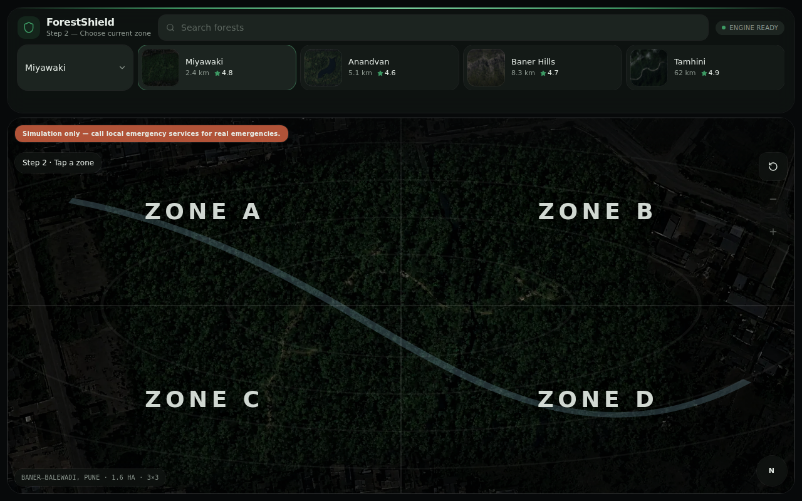
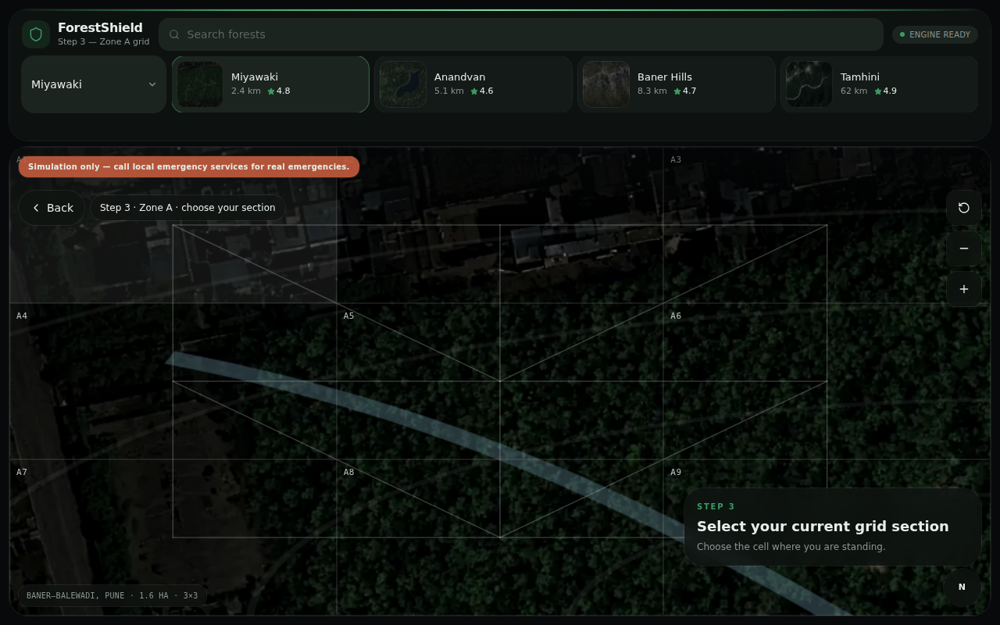
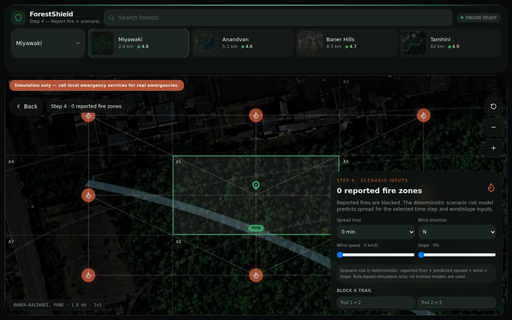
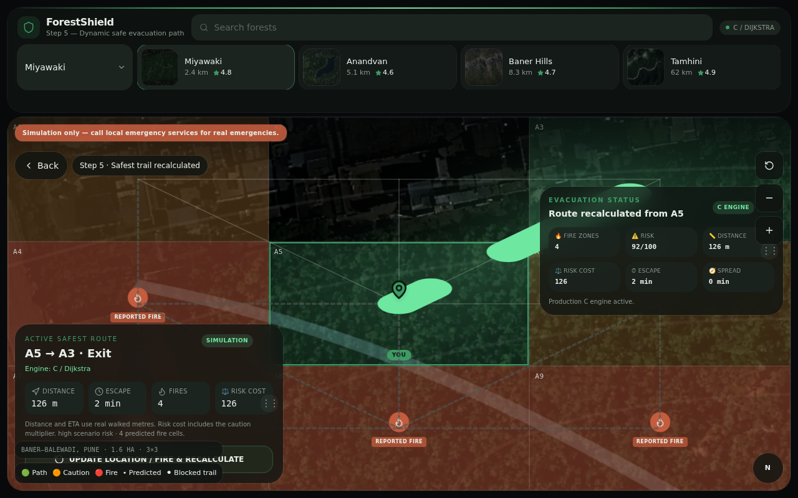
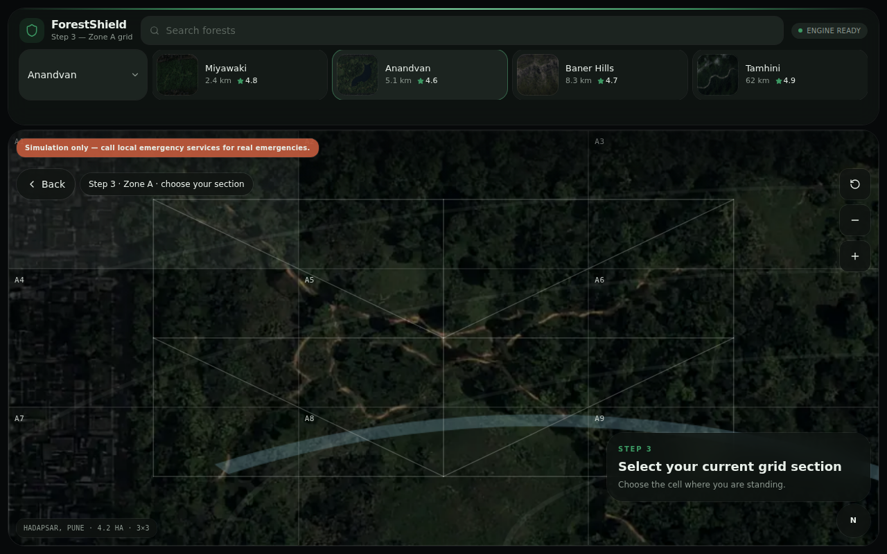
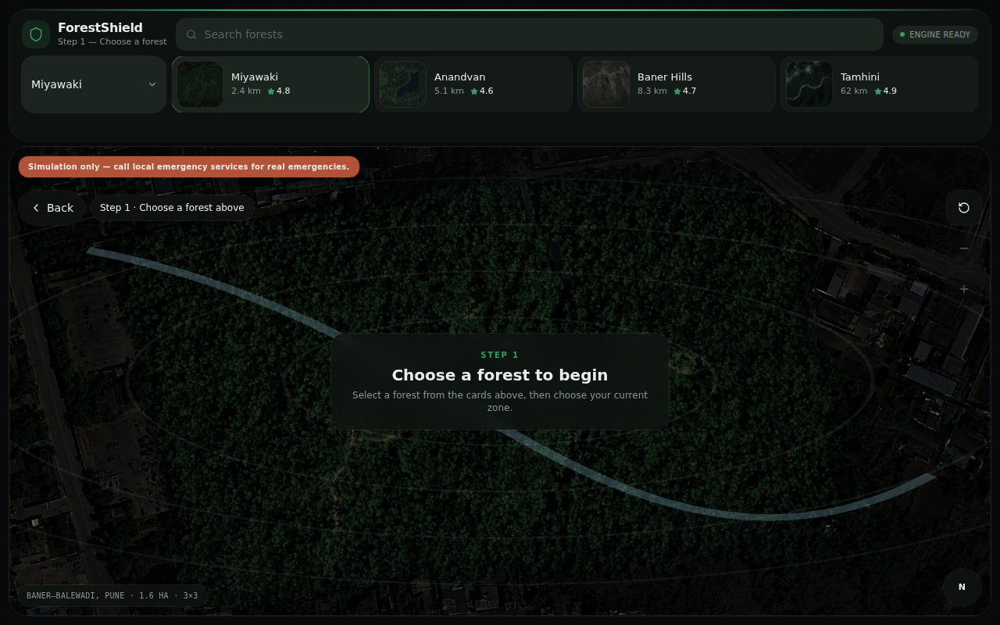
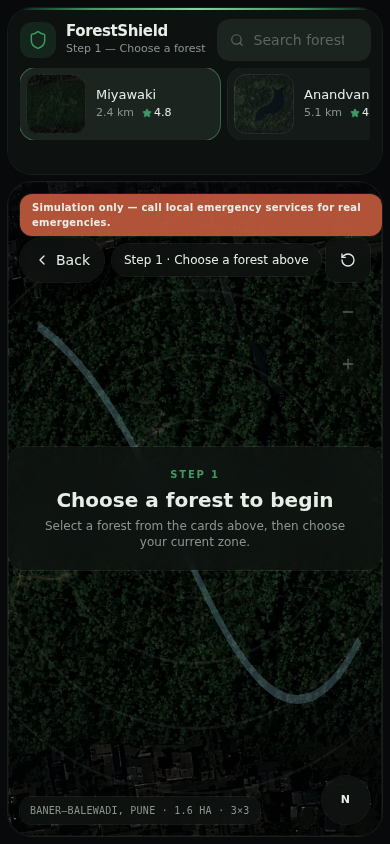

# ForestShield

**Simulation-Based Forest Evacuation Route Demonstrator**

## Overview

ForestShield is a simulation-only forest evacuation demonstrator. A user picks a forest, marks their position on a grid, reports fire cells and scenario conditions (wind, slope, spread horizon), and the app calculates the lowest-risk evacuation route to an exit. It is a deterministic, rule-based simulation that uses no trained models and is not an AI project.

## Problem Statement

During a forest fire, the shortest path out is not always the safest one. Fire can block trails, and wind and slope change how quickly it spreads. ForestShield demonstrates how evacuation routes can be recomputed on a trail graph when fire locations and environmental conditions change, using classic graph algorithms that are easy to inspect and test.

## Features

- Four forest environments: Miyawaki, Anandvan, Baner Hills and Tamhini, each with its own trail graph and exits
- Forest map visualization with a zone and grid-cell overlay
- Five-step flow: choose forest, zone, grid cell, report fire and scenario, review route
- Simulated fire spread over a 0 / 10 / 20 / 30 minute horizon
- Wind direction (8 compass directions) and wind speed inputs
- Slope effect on fire spread
- User-blockable trails
- Evacuation exits with per-exit weights
- Route finding with distance and walking-time estimates
- Scenario risk score with a plain-language summary
- TypeScript pathfinding fallback
- Native C pathfinding engine served over a small HTTP API
- Deterministic results, with C and TypeScript engines checked for parity in tests
- Automated tests

## How It Works

**Graph representation.** Each forest is a grid of cells (3x3 in the shipped configuration) connected by weighted trail edges, plus a virtual exit node. Topology, exits, exit weights and constants live in one file, `config/forest-graph.json`.

**Fire spread (BFS layers).** Starting from the reported fire cells, spread expands outward through neighbouring cells in breadth-first layers, one layer per 10 minutes. Each candidate cell gets a deterministic score that rises with wind alignment, wind speed and slope. Cells are ranked by that score, ties are broken by cell index, and a capped number of cells ignite per step.

**Risk scoring.** The scenario risk score (0-100) is a transparent formula over the number of reported fires, the number of additional spread cells, wind speed and slope. It is bucketed into low, moderate and high.

**Routing (Dijkstra with a priority queue).** Fire cells are blocked. Cells adjacent to fire are "caution" cells, and trails into them cost more (a configurable multiplier). Dijkstra's algorithm, backed by a min-heap priority queue, finds the lowest-cost path to the exit. Blocked trails are removed from the graph.

**Two engines, one result.** The C engine (`c/`) implements the graph, BFS queue, priority queue and Dijkstra. The React app probes it at `/c-api/health` and uses it when available. Otherwise it falls back to the TypeScript implementation in `src/lib/pathfinder.ts`, and the UI shows which engine produced the result. `c/graph_config.h` is generated from the shared JSON so both engines use the same data.

## Technology Stack

- React 19 and TypeScript
- Vite, with TanStack Start / TanStack Router and Nitro
- Tailwind CSS 4
- lucide-react icons
- C (C11) for the native engine, built with Make
- ESLint and Prettier
- Node.js built-in test runner

## Project Structure

```
ForestShield/
├── README.md
├── START-HERE.md
├── package.json
├── package-lock.json
├── .gitignore
├── .env.example
├── .prettierrc
├── Makefile                 # delegates to c/Makefile
├── Dockerfile.c-engine      # container image for the C engine
├── startup.sh
├── eslint.config.mjs
├── tsconfig.json
├── vite.config.ts
├── config/
│   └── forest-graph.json    # single source of truth for graphs, exits, constants
├── src/
│   ├── components/          # forest map, top bar
│   ├── lib/                 # pathfinder, risk model, engine selection, tests
│   └── routes/              # app routes
├── c/                       # native engine
│   ├── graph.c / graph.h
│   ├── dijkstra.c
│   ├── queue.c
│   ├── priority_queue.c
│   ├── server.c
│   ├── graph_config.h       # generated from config/forest-graph.json
│   ├── Makefile
│   └── web/                 # standalone demo page served by the C server
├── public/
│   └── maps/                # forest map images
├── scripts/                 # C config generator and tests
└── screenshots/
```

## Installation

Requires Node.js 22 or newer. A C compiler and `make` are needed only for the native engine.

```bash
npm install
```

## Running the Project

```bash
npm run dev
```

Open `http://localhost:8081/`. Without the C engine running, the app uses the TypeScript fallback and says so in the UI.

## Native C Engine

```bash
npm run generate:c-config   # regenerate c/graph_config.h from config/forest-graph.json
make -C c                   # build c/forestshield
make -C c test              # run the sample evacuation commands
./c/forestshield            # start the HTTP engine on port 8090
```

The dev server proxies `/c-api/*` to `http://127.0.0.1:8090`. For a deployed app, set `VITE_C_ENGINE_URL` (see `.env.example`) or configure the same reverse proxy. `Dockerfile.c-engine` builds a container for the engine.

You can also run the engine from the command line:

```bash
./c/forestshield evacuate miyawaki A5 A7 --spread 20 --wind-direction 90 --wind-speed 30 --slope 10
```

## Testing

```bash
npm test               # regenerates the C config, then runs TypeScript, config and C-parity tests
npm run typecheck      # tsc --noEmit
npm run lint           # eslint
npm run build          # production build
make -C c test         # native engine sample runs
```

## Screenshots

Desktop views:











Home screen and mobile view:





## Disclaimer

ForestShield is an educational simulation project. It does not provide real-time fire detection, authoritative emergency instructions, or guaranteed real-world evacuation guidance.

In an actual emergency, follow the instructions of your local emergency authorities and call your local emergency number.

## License

No license file is included in this project, so no license has been granted. If you publish the repository, add a license of your choice.
